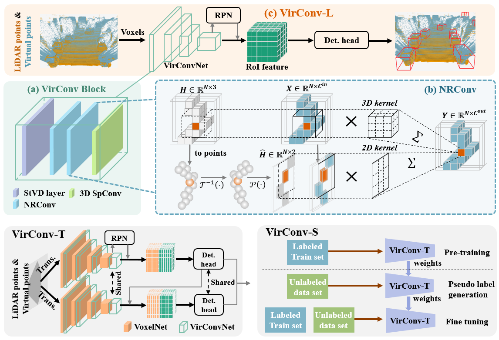

# Virtual Sparse Convolution for Multimodal 3D Object Detection
This is a official code release of [VirConv](https://arxiv.org/abs/2303.02314) (Virtual Sparse Convolution for 3D Object Detection). 
This code is mainly based on [OpenPCDet](https://github.com/open-mmlab/OpenPCDet), some codes are from [TED](https://github.com/hailanyi/TED), 
[CasA](https://github.com/hailanyi/CasA), [PENet](https://github.com/JUGGHM/PENet_ICRA2021) and [SFD](https://github.com/LittlePey/SFD).

## Detection Framework
* VirConv-L: A light-weight multimodal 3D detector based on Virtual Sparse Convolution.
* VirConv-T: A improved multimodal 3D detector based on Virtual Sparse Convolution and transformed refinement scheme.
* VirConv-S: A semi-supervised VirConv-T based on pseudo labels and fine-tuning.

The detection frameworks are shown below.



## Model Zoo
We release three models: VirConv-L, VirConv-T and VirConv-S.

* The VirConv-L and VirConv-T are trained with train split (3712 samples) of KITTI dataset.

* The VirConv-S is trained with train split (3712 samples) and unlabeled odometry split (semi split 10888 sample) of KITTI dataset.

* The results are the 3D AP(R40) of Car on the *val* set of KITTI dataset.

**Important notes:**
* **The input voxel discard has been changed to [input point discard](https://github.com/hailanyi/VirConv/blob/master/pcdet/datasets/dataset.py) for faster voxelization.**
* **The convergence of VirConv-T is somewhat unstable ( AP~\[89.5,90.3\]), if you cannot achieve similar AP, please try multiple times. We recommend VirConv-S, which can achieve 90.5+ AP easily.**
* **These models are not suitable to directly report results on KITTI *test* set, please train the models on all or 80% training data and choose a good score threshold to achieve a desirable performance.**

Train multiple times on 8xV100 and choose the best:

Environment|              Detector                   | GPU (train)| Easy | Mod. | Hard  | download | 
|------|---------------------------------------------|:----------:|:-------:|:-------:|:-------:|:---------:|
|Spconv1.2 | [VirConv-L](tools/cfgs/models/kitti/VirConv-L.yaml)|~7 GB | 93.08 |88.51 |86.69 | [google](https://drive.google.com/file/d/1UwH4ArmKCAPlFV6XjRmVrqClgrvc1M1q/view?usp=sharing) / [baidu(05u2)](https://pan.baidu.com/s/1Q-hvk-u6bA72EFhcc5IIwA) / 51M| 
|Spconv1.2 | [VirConv-T](tools/cfgs/models/kitti/VirConv-T.yaml)|~13 GB| 94.58 |89.87 |87.78 | [google](https://drive.google.com/file/d/1Y3Q0x0pDran0Bqqg1CulL0geYwIkDQvu/view?usp=sharing) / [baidu(or81)](https://pan.baidu.com/s/1CkMi5YYKjBfi4sgnx20fIw) / 55M|
|Spconv1.2 | [VirConv-S](tools/cfgs/models/kitti/VirConv-S.yaml)|~13 GB| 95.67 |91.09 |89.09 | [google](https://drive.google.com/file/d/1_IUkMzGlPdZTiCyiBn1GaCMYKVbi9Oh2/view?usp=sharing) / [baidu(ak74)](https://pan.baidu.com/s/1PZURrn97OoFQyBGb0hJX3A) / 62M|

Train multiple times on 8xV100 and choose the best:

Environment|              Detector                   |GPU (train) | Easy | Mod. | Hard  | download | 
|------|---------------------------------------------|:----------:|:-------:|:-------:|:-------:|:---------:|
|Spconv2.1 | [VirConv-L](tools/cfgs/models/kitti/VirConv-L.yaml)|~7 GB | 93.18 |88.23 |85.48 | [google](https://drive.google.com/file/d/1MRRgMX8l5FFaFZb81YjqfcjCFgYYDMak/view?usp=sharing) / [baidu(k2dp)](https://pan.baidu.com/s/1fOSbDup5x2pootf3dtPb8Q) / 51M| 
|Spconv2.1 | [VirConv-T](tools/cfgs/models/kitti/VirConv-T.yaml)|~13 GB| 94.91 |90.36 |88.10 | [google](https://drive.google.com/file/d/123ndzJIwo01DvQIBzy_GnussuuXkhwji/view?usp=sharing) / [baidu(a4r4)](https://pan.baidu.com/s/1ueAUwj57DIEgF7NBKtgCmA) / 56M|
|Spconv2.1 | [VirConv-S](tools/cfgs/models/kitti/VirConv-S.yaml)|~13 GB| 95.76 |90.91 |88.61 | [google](https://drive.google.com/file/d/1-ztIQdhAi2MnTI6pBKxUeqWZnwlDxDH3/view?usp=sharing) / [baidu(j3mi)](https://pan.baidu.com/s/1iJUjR7IehRBk1WSacvd2Yg) / 56M|


## Getting Started
```
conda create -n spconv2 python=3.9
conda activate spconv2
pip install numpy==1.19.5 protobuf==3.19.4 scikit-image==0.19.2 waymo-open-dataset-tf-2-2-0 nuscenes-devkit==1.0.5 spconv-cu111 numba scipy pyyaml easydict fire tqdm shapely matplotlib opencv-python addict pyquaternion awscli open3d pandas future pybind11 tensorboardX tensorboard Cython
pip install torch==1.8.1+cu111 torchvision==0.9.1+cu111 torchaudio==0.8.1 -f https://download.pytorch.org/whl/torch_stable.html
```
### Dependency
Our released implementation is tested on.
+ Ubuntu 18.04
+ Python 3.6.9 
+ PyTorch 1.8.1
+ Numba 0.53.1
+ Spconv 1.2.1
+ NVIDIA CUDA 11.1
+ 8x Tesla V100 GPUs


We also tested on.
+ Ubuntu 18.04
+ Python 3.9.13 
+ PyTorch 1.8.1
+ Numba 0.53.1
+ Spconv 2.1.22 # pip install spconv-cu111
+ NVIDIA CUDA 11.1 
+ 8x Tesla V100 GPUs

We also tested on.
+ Ubuntu 18.04
+ Python 3.9.13 
+ PyTorch 1.8.1
+ Numba 0.53.1
+ Spconv 2.1.22 # pip install spconv-cu111
+ NVIDIA CUDA 11.1 
+ 2x 3090 GPUs


### Prepare dataset

You must creat additional ```semi``` dataset and ```velodyne_depth``` dataset to run our multimodal and semi-supervised detectors.

* You can download all the preprocessed data from
[baidu (japc)](https://pan.baidu.com/s/1idoCSVndT2mImcGN4lFSNQ) \[74GB\],
or partial data (not include ```semi``` due to disk space limit )
from [google (13GB)](https://drive.google.com/file/d/1xki9v_zsQMM8vMVNo0ENi1Mh_GNMjHUg/view?usp=sharing).


* Or you can generate the dataset by yourself as follows:

Please download the official [KITTI 3D object detection](http://www.cvlibs.net/datasets/kitti/eval_object.php?obj_benchmark=3d) 
dataset, [KITTI odometry dataset](https://www.cvlibs.net/datasets/kitti/eval_odometry.php) and organize the downloaded files as follows (the road planes could be downloaded 
from [[road plane]](https://drive.google.com/file/d/1d5mq0RXRnvHPVeKx6Q612z0YRO1t2wAp/view?usp=sharing), 
which are optional for data augmentation in the training):

```
VirConv
├── data
│   ├── odometry
│   │   │── 00
│   │   │── 01
│   │   │   │── image_2
│   │   │   │── velodyne
│   │   │   │── calib.txt
│   │   │── ...
│   │   │── 21
│   ├── kitti
│   │   │── ImageSets
│   │   │── training
│   │   │   ├──calib & velodyne & label_2 & image_2 & (optional: planes)
│   │   │── testing
│   │   │   ├──calib & velodyne & image_2
├── pcdet
├── tools
```

(1) Creat ```semi``` dataset from odometry dataset.
```
cd tools
python3 creat_semi_dataset.py ../data/odometry ../data/kitti/semi
```
(2) Download the pseudo labels generated by VirConv-T from [here](https://drive.google.com/file/d/1wyMgqUjhdXUEDiY8NYO_doFMfKtAn0X8/view?usp=sharing) (fuse detections from last 10 checkpoints by WBF and filter low quality detections by a 0.9 score threshold) and put it into ```kitti/semi```.

(3) Download the PENet depth completion model from [google (500M)](https://drive.google.com/file/d/1RDdKlKJcas-G5OA49x8OoqcUDiYYZgeM/view?usp=sharing) or [baidu (gp68)](https://pan.baidu.com/s/1tBVuqvBZ0ns79ARmNpgwWw), and put it into ```tools/PENet```.

(4) Then run the following code to generate RGB virtual points.

```
cd tools/PENet
python3 main.py --detpath ../../data/kitti/training
python3 main.py --detpath ../../data/kitti/testing
python3 main.py --detpath ../../data/kitti/semi
```
(5) After that, run following command to creat dataset infos:
```
python3 -m pcdet.datasets.kitti.kitti_dataset_mm create_kitti_infos tools/cfgs/dataset_configs/kitti_dataset.yaml
python3 -m pcdet.datasets.kitti.kitti_datasetsemi create_kitti_infos tools/cfgs/dataset_configs/kitti_dataset.yaml
```

Anyway, the data structure should be: 
```
VirConv
├── data
│   ├── kitti
│   │   │── ImageSets
│   │   │── training
│   │   │   ├──calib & velodyne & label_2 & image_2 & (optional: planes) & velodyne_depth
│   │   │── testing
│   │   │   ├──calib & velodyne & image_2 & velodyne_depth
│   │   │── semi (optional)
│   │   │   ├──calib & velodyne & label_2(pseudo label) & image_2 & velodyne_depth
│   │   │── gt_database_mm
│   │   │── gt_databasesemi
│   │   │── kitti_dbinfos_trainsemi.pkl
│   │   │── kitti_dbinfos_train_mm.pkl
│   │   │── kitti_infos_test.pkl
│   │   │── kitti_infos_train.pkl
│   │   │── kitti_infos_trainsemi.pkl
│   │   │── kitti_infos_trainval.pkl
│   │   │── kitti_infos_val.pkl
├── pcdet
├── tools
```

### Setup

```
cd VirConv
python setup.py develop
```

### Training.

**For training the VirConv-L and VirConv-T:**

Single GPU train:
```
cd tools
python3 train.py --cfg_file ${CONFIG_FILE}
```
For example, if you train the VirConv-L model:
```
cd tools
python3 train.py --cfg_file cfgs/models/kitti/VirConv-L.yaml
```

Multiple GPU train: 

You can modify the gpu number in the dist_train.sh and run
```
cd tools
sh dist_train.sh
```
The log infos are saved into log.txt
You can run ```cat log.txt``` to view the training process.

**For training the VirConv-S:**

You should firstly train a VirConv-T:
```
cd tools
python3 train.py --cfg_file cfgs/models/kitti/VirConv-T.yaml
```
Then train the VirConv-S:
```
cd tools
python3 train.py --cfg_file cfgs/models/kitti/VirConv-S.yaml --pretrained_model ../output/models/kitti/VirConv-T/default/ckpt/checkpoint_epoch_40.pth
```

### Evaluation.

```
cd tools
python3 test.py --cfg_file ${CONFIG_FILE} --batch_size ${BATCH_SIZE} --ckpt ${CKPT}
```

For example, if you test the VirConv-S model:

```
cd tools
python3 test.py --cfg_file cfgs/models/kitti/VirConv-S.yaml --ckpt VirConv-S.pth
```

Multiple GPU test: you should modify the gpu number in the dist_test.sh and run
```
sh dist_test.sh 
```
The log infos are saved into log-test.txt
You can run ```cat log-test.txt``` to view the test results.
## License

This code is released under the [Apache 2.0 license](LICENSE).

## Acknowledgement
[TED](https://github.com/hailanyi/TED)

[CasA](https://github.com/hailanyi/CasA)

[OpenPCDet](https://github.com/open-mmlab/OpenPCDet)

[PENet](https://github.com/JUGGHM/PENet_ICRA2021)

[SFD](https://github.com/LittlePey/SFD)

## Citation

```
@inproceedings{VirConv,
    title={Virtual Sparse Convolution for Multimodal 3D Object Detection},
    author={Wu, Hai and Wen,Chenglu and Shi, Shaoshuai and Wang, Cheng},
    booktitle={CVPR},
    year={2023}
}
```


